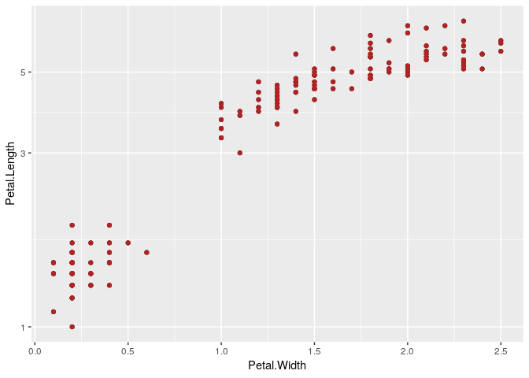

First components of the ggspec function
================

<br/>

This document builds off `01-ggspec-components` and incorporates Ian’s
[architecture ideas](https://github.com/vegawidget/ggspec/issues/1).

-----

## Extracting elements

<br/>

``` r
p <- ggplot(iris) + 
  geom_point(aes(x = Petal.Width, y = Petal.Length)) + 
  geom_point(aes(x = Petal.Width, y = Petal.Length), color = "firebrick") +
  scale_y_log10()

p
```

<!-- -->

<br/>

-----

### Extracting data

The first move will be to create the list `data` where all of the data
will live.

<!-- QUESTION: what to do about `waiver()` objects? -->

`data_int()` will create an intermediate-form for the data. The inputs
are the plot data and the plot layers. The result is a named list of
datasets where each list contains the elements `metadata`, `variables`,
and `hash`.

``` r
data_int <- function(data_plt, layers_plt) {
  # Return a named list of datasets, named `data-00`, `data-01`, ... 
  
  dat_default <- list(`data-00` = data_plt) 
  dat_layers <- get_layer_dat(layers_plt)
  
  #join together default data and layer data
  dat <- append(dat_default, dat_layers)
  
  #format the lists of data
  map(dat, format_data_int)
  
}
```

#### Helper functions

`get_layer_dat()` will grab all of the data saved in the layers and
return a list of datasets. I still need to determine how to *name* the
datasets and determine what to do when the default data is to be used
for that layer.

``` r
get_layer_dat <- function(layers_plt) {
  # save all the data as a list
  dats <- map(layers_plt, pluck, "data")
  # name the datasets and give all NULL entries the default name `data-00`
  
  
  dats
}
```

`create_meta_levels()`

``` r
# create_meta_levels <- function(dat){
#   loc <- purrr::detect_index(dat, is.factor)
#   levels <- purrr::pluck(dat, loc, levels)
#   meta <- list(levels) ## How to evaluate the name first??
#   names(meta) <- names(dat)[loc]
#   meta
# }
# 
```

`format_data_int()` will format each list of data so that it contains:  
\- `metadata`, discussed below  
\- `variables`, the data frame itself  
\- `hash`, the md5 hash of the data frame

`metadata` could be a named list, using names of variables:  
\- `type`, first pass at `"quantitative"`, …, based on class, etc.  
\- `levels`, optional, vector of strings, used for factor-levels

``` r
format_data_int <- function(dat) {
  if(!is.waive(dat)) {
    if(!is.null(dat)) {
      list(
        metadata = map(dat, class),
        variables = dat,
        hash = NULL
      )
    }
  }
}
```

Example of the function in use:

``` r
str(data_int(p$data, p$layers))
```

    ## List of 3
    ##  $ data-00:List of 3
    ##   ..$ metadata :List of 5
    ##   .. ..$ Sepal.Length: chr "numeric"
    ##   .. ..$ Sepal.Width : chr "numeric"
    ##   .. ..$ Petal.Length: chr "numeric"
    ##   .. ..$ Petal.Width : chr "numeric"
    ##   .. ..$ Species     : chr "factor"
    ##   ..$ variables:'data.frame':    150 obs. of  5 variables:
    ##   .. ..$ Sepal.Length: num [1:150] 5.1 4.9 4.7 4.6 5 5.4 4.6 5 4.4 4.9 ...
    ##   .. ..$ Sepal.Width : num [1:150] 3.5 3 3.2 3.1 3.6 3.9 3.4 3.4 2.9 3.1 ...
    ##   .. ..$ Petal.Length: num [1:150] 1.4 1.4 1.3 1.5 1.4 1.7 1.4 1.5 1.4 1.5 ...
    ##   .. ..$ Petal.Width : num [1:150] 0.2 0.2 0.2 0.2 0.2 0.4 0.3 0.2 0.2 0.1 ...
    ##   .. ..$ Species     : Factor w/ 3 levels "setosa","versicolor",..: 1 1 1 1 1 1 1 1 1 1 ...
    ##   ..$ hash     : NULL
    ##  $        : NULL
    ##  $        : NULL

<br/>

This intermediate-form could be used to generate the ggspec-form; it
could also be useful later.

``` r
format_data_spec <- function(dat) {
  if(!is.null(dat)) {
    list(
      metadata = dat$metadata,
      observations = transpose(dat$variables)
    )
  }
}

data_spc <- function(data_int) {
  # Return a named list of datasets, named `data-00`, `data-01`, ... 
  # Each list will have:
  #   - `metadata`, as in data_int()
  #   - `observations`, transpose of variables
  map(data_int, format_data_spec)
}
```

``` r
str(data_spc(data_int(p$data, p$layers)), max.level = 2)
```

    ## List of 3
    ##  $ data-00:List of 2
    ##   ..$ metadata    :List of 5
    ##   ..$ observations:List of 150
    ##  $        : NULL
    ##  $        : NULL

<br/>

-----

### Extracting layers

<br/>

Within each layer-object, we need:  
1\. data (a reference id?)  
2\. geom  
3\. geom\_params (maybe)  
4\. mapping  
5\. aes\_params  
6\. stat (maybe)  
7\. stat\_params (maybe)

<br/>

The ggspec layers are a function of the ggplot layers, but also of the
data and scales:

``` r
layer_spc <- function(layer_plt, data_int, scales_spc) {
  # Operates on a single layer, used with purrr::map() to get `layers_spc`
  #   - if `layer_plt` has no data, use `data-00`
  #   - if `layer_plt` has data, hash it and compare against `data_int`, use name
  #   - make sure that the mapping field is a name in the dataset
  #   - can use type from the dataset metadata for now, can incorporate scales later
  list(
    data = list(),
    geom = list(
      class = purrr::pluck(layer_plt, "geom", class, 1)
    ),
    mapping = purrr::pluck(layer_plt, "mapping") %>% map(get_mappings),
    aes_params = purrr::pluck(layer_plt, "aes_params"),
    stat = list(
      class = purrr::pluck(layer_plt, "stat", class, 1)
    )
  )
}
```

Helper functions:

``` r
get_mappings <- function(aes) {
  list(field = rlang::get_expr(aes),
       type = NULL
  ) %>% set_names(purrr::pluck(names))
}
```

Example of function being used:

``` r
str(map(p$layers, layer_spc))
```

    ## List of 2
    ##  $ :List of 5
    ##   ..$ data      : list()
    ##   ..$ geom      :List of 1
    ##   .. ..$ class: chr "GeomPoint"
    ##   ..$ mapping   :List of 2
    ##   .. ..$ x:List of 2
    ##   .. .. ..$ : symbol Petal.Width
    ##   .. .. ..$ : NULL
    ##   .. ..$ y:List of 2
    ##   .. .. ..$ : symbol Petal.Length
    ##   .. .. ..$ : NULL
    ##   ..$ aes_params: NULL
    ##   ..$ stat      :List of 1
    ##   .. ..$ class: chr "StatIdentity"
    ##  $ :List of 5
    ##   ..$ data      : list()
    ##   ..$ geom      :List of 1
    ##   .. ..$ class: chr "GeomPoint"
    ##   ..$ mapping   :List of 2
    ##   .. ..$ x:List of 2
    ##   .. .. ..$ : symbol Petal.Width
    ##   .. .. ..$ : NULL
    ##   .. ..$ y:List of 2
    ##   .. .. ..$ : symbol Petal.Length
    ##   .. .. ..$ : NULL
    ##   ..$ aes_params:List of 1
    ##   .. ..$ colour: chr "firebrick"
    ##   ..$ stat      :List of 1
    ##   .. ..$ class: chr "StatIdentity"

<br/>

I think that scales will be one-to-one:

will need to check if there is anything there…

``` r
scale_spc <- function(scale_plt) {
# Operates on a single scale, used with purrr::map() to get `scales_spc`
   list(
    class = purrr::pluck(scale_plt, class, 1),
    aesthetics = purrr::pluck(scale_plt, "aesthetics"),
    transform = list(
      name = purrr::pluck(scale_plt, "trans", "name")
    )
  )
}
```

``` r
map(p$scales$scales, scale_spc)
```

    ## [[1]]
    ## [[1]]$class
    ## [1] "ScaleContinuousPosition"
    ## 
    ## [[1]]$aesthetics
    ##  [1] "y"          "ymin"       "ymax"       "yend"       "yintercept"
    ##  [6] "ymin_final" "ymax_final" "lower"      "middle"     "upper"     
    ## 
    ## [[1]]$transform
    ## [[1]]$transform$name
    ## [1] "log-10"

<br/>

-----

### Extracting labels

Finally, labels:

``` r
find_scale_labs <- function(labs) {
    lab <- pluck(labs, "name")
    if(!is.waive(lab)) {
      names(lab) <- pluck(labs, "aesthetics", 1)
      lab
    }
    
}

labels_spc <- function(labels_plt, scales_plt) {
# Find the right way to deal with labels - we could run into a
# problem if we have, say, multiple color scales
  scale_labs <- map(p_scale$scales$scales, find_scale_labs)
  
  # How to replace the labels with scale labels???
  

      names(scale_labs)
    names(p_scale$labels)

}
```

``` r
p_lab <- ggplot(iris) + 
  geom_point(aes(x = Petal.Width, y = Petal.Length)) + 
  geom_point(aes(x = Petal.Width, y = Petal.Length), color = "firebrick") +
  scale_y_log10() +
  labs(x = "new lab")

p_scale <- ggplot(iris) + 
  geom_point(aes(x = Petal.Width, y = Petal.Length)) + 
  geom_point(aes(x = Petal.Width, y = Petal.Length), color = "firebrick") +
  scale_y_log10("new lab") 
```
