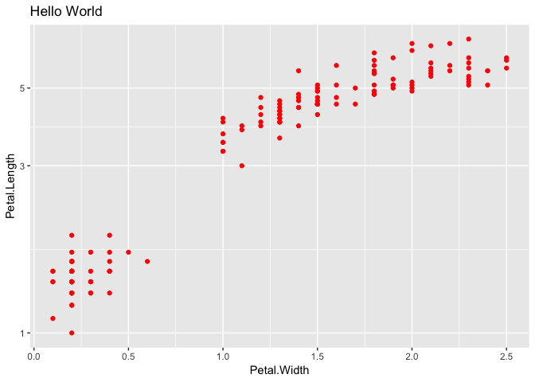

Iris scatterplot 01
================

``` r
library("ggplot2")
library("readr")
library("listviewer")
```

Here’s a ggplot:

``` r
p <-
  ggplot(iris) +
  geom_point(aes(x = Petal.Width, y = Petal.Length), color = "red") + 
  scale_y_continuous(trans = "log10") + 
  labs(
    title = "Hello World"
  )

p
```

<!-- -->

Here’s a proposal for a ggspec:

``` r
json <- read_file("iris-scatterplot-01.json")
jsonedit(json, mode = "code")
```

<!--html_preserve-->

<div id="htmlwidget-6a4a736d7f6af7f1093d" class="jsonedit html-widget" style="width:672px;height:480px;">

</div>

<script type="application/json" data-for="htmlwidget-6a4a736d7f6af7f1093d">{"x":{"data":"{\n  \"data\": {\n    \"data-00\": {\n      \"meta\": {},\n      \"df\": [{}, {}]\n    }\n  },\n  \"layers\": [\n    {\n      \"mapping\": {\n        \"x\": {\"field\": \"Petal.Width\"},\n        \"y\": {\"field\": \"Petal.Length\"}\n      },\n      \"aes_params\": {\n        \"colour\": {\"value\": \"red\"}\n      }\n    }\n  ],\n  \"scales\": [\n    {\n      \"class\": [\"ScaleContinuousPosition\", \"ScaleContinuous\"],\n      \"aesthetics\": [\"x\"]\n    },\n    {\n      \"class\": [\"ScaleContinuousPosition\", \"ScaleContinuous\"],\n      \"aesthetics\": [\"y\"],\n      \"transform\": {\"type\": \"log\", \"base\": 10}\n    }\n  ],\n  \"labels\": {\n    \"title\": \"Hello World\"\n  }\n}\n","options":{"mode":"code","modes":["code","form","text","tree","view"]}},"evals":[],"jsHooks":[]}</script>

<!--/html_preserve-->
